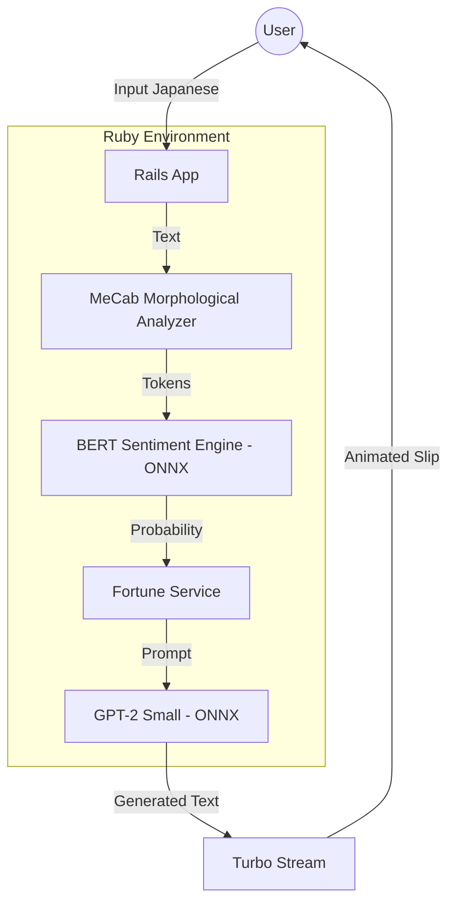

# System Architecture: Sentiment Omikuji

This document details the technical implementation of the Sentiment Omikuji application, spanning from the machine learning training pipeline to the real-time Ruby on Rails inference engine.

## 1. High-Level Overview
The application is a self-contained AI monolith. Unlike most modern AI apps that rely on external APIs (like OpenAI), this project performs all deep learning inference locally on the Ruby process using the ONNX Runtime.

## 2. Machine Learning Pipeline

### A. Sentiment Analysis (The Ear)
- **Base Model:** `cl-tohoku/bert-base-japanese-v3`
- **Training:** Fine-tuned on a subset of the Amazon Japanese Reviews dataset (500 pre-processed records).
- **Format:** Exported to ONNX Opset 17 with dynamic axes for batch size and sequence length.
- **Optimization:** Implemented a Softmax layer in Ruby to normalize raw logits into 0-1 probabilities for the UI.

### B. Fortune Generation (The Voice)
- **Model:** `rinna/japanese-gpt2-small` (approx. 450MB).
- **Inference:** Native ONNX execution.
- **Decoding Strategy:** Implemented **Top-P (Nucleus) Sampling** with a **Repetition Penalty** and **Temperature scaling** (0.6) to ensure varied, mystical, and coherent Japanese output.

## 3. Tokenization Strategy
Japanese NLP requires specialized handling since there are no spaces between words.

1.  **Morphological Analysis:** We use the `natto` gem to interface with the system's `MeCab` installation. This segments sentences into discrete words (morphemes).
2.  **WordPiece Encoding:** Segmented words are passed to the `tokenizers` gem (using the original BERT `vocab.txt`) to produce the final `input_ids` and `attention_mask` for the model.
3.  **GPT-2 Tokenization:** Uses a SentencePiece-based `tokenizer.json` loaded directly into the Ruby `Tokenizers` library.

## 4. Rails Implementation Details
- **Singleton Model Loading:** To prevent memory bloat, models are loaded once into memory upon application boot using the `ModelLoader` singleton.
- **Turbo Streams:** Provides sub-second UI updates. The "shaking box" animation is managed by a Stimulus controller that listens for Turbo lifecycle events.
- **Direct Inference:** By using the `onnxruntime` gem, we bypass the need for a Python sidecar or Flask API, significantly reducing latency and infrastructure complexity.

## 5. Deployment Strategy
- **Platform:** Fly.io (Docker-based Micro-VMs).
- **Hardware:** 2GB RAM minimum required for concurrent BERT and GPT-2 sessions.
- **Region:** `nrt` (Tokyo) for optimal latency for Japanese character processing.
