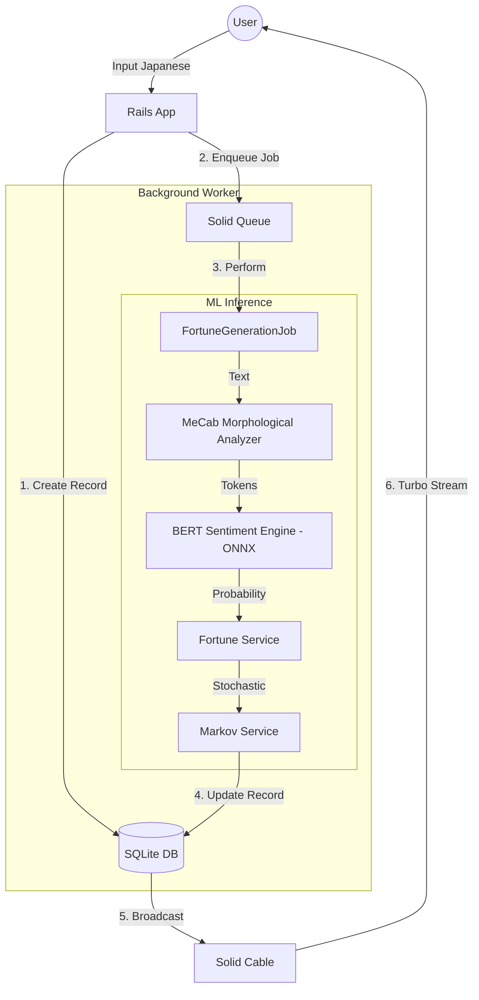

# System Architecture: Sentiment Omikuji

This document details the technical implementation of the Sentiment Omikuji application, spanning from the machine learning training pipeline to the real-time Ruby on Rails inference engine.

## 1. High-Level Overview
The application is a self-contained AI monolith. Unlike most modern AI apps that rely on external APIs (like OpenAI), this project performs all deep learning inference locally on the Ruby process using the ONNX Runtime. The application follows a modern Rails 8 architecture, utilizing the "Solid" stack for database-backed infrastructure.

```mermaid
graph TD
    User((User)) -->|Input Japanese| Rails[Rails App]
    Rails -->|1. Create Record| DB[(SQLite DB)]
    Rails -->|2. Enqueue Job| SQ[Solid Queue]
    
    subgraph Background Worker
        SQ -->|3. Perform| Job[FortuneGenerationJob]
        subgraph ML Inference
            Job -->|Text| MeCab[MeCab Morphological Analyzer]
            MeCab -->|Tokens| BERT[BERT Sentiment Engine - ONNX]
            BERT -->|Probability| FortuneSvc[Fortune Service]
            FortuneSvc -->|Stochastic| Markov[Markov Service]
        end
        Markov -->|4. Update Record| DB
    end
    
    DB -->|5. Broadcast| Cable[Solid Cable]
    Cable -->|6. Turbo Stream| User
```

## 2. Machine Learning Pipeline

### A. Sentiment Analysis (The Ear)
- **Base Model:** `cl-tohoku/bert-base-japanese-v3`
- **Training:** Fine-tuned on a subset of the Amazon Japanese Reviews dataset (500 pre-processed records).
- **Format:** Exported to ONNX Opset 17 with dynamic axes for batch size and sequence length.
- **Optimization:** Implemented a Softmax layer in Ruby to normalize raw logits into 0-1 probabilities for the UI.

### B. Fortune Generation (The Voice)
- **Engine:** Custom Markov Service.
- **Inference:** Pure Ruby morphological n-gram prediction.
- **Decoding Strategy:** Implemented a **Bigram State-Map** with stochastic selection to ensure varied, mystical, and coherent Japanese output without the memory overhead of a full Transformer model.

## 3. Tokenization Strategy
Japanese NLP requires specialized handling since there are no spaces between words.

1.  **Morphological Analysis:** We use the `natto` gem to interface with the system's `MeCab` installation. This segments sentences into discrete words (morphemes) for both BERT and the Markov chain.
2.  **WordPiece Encoding:** Segmented words are passed to the `tokenizers` gem (using the original BERT `vocab.txt`) to produce the final `input_ids` and `attention_mask` for the BERT model.

## 4. Rails Implementation Details
- **Solid Stack:** The application leverages the "Solid" stack for critical infrastructure, replacing external dependencies like Redis:
    - **Solid Queue:** Database-backed Active Job adapter for background processing.
    - **Solid Cache:** Database-backed cache store.
    - **Solid Cable:** Database-backed Action Cable adapter for real-time updates.
- **Multi-Database SQLite:** In production, the application uses multiple SQLite databases to isolate concerns and prevent contention:
    - `primary`: Main application data (Fortunes).
    - `queue`: Solid Queue jobs and metadata.
    - `cache`: Solid Cache entries.
    - `cable`: Solid Cable messages.
- **Asynchronous Inference:** To maintain UI responsiveness, ML inference is performed in background jobs (`FortuneGenerationJob`). The Rails controller creates a record and enqueues the job, returning immediately to the user.
- **Turbo Streams:** Provides real-time UI updates. When the background job completes and updates the `Fortune` record, an `after_update_commit` hook broadcasts the results via Turbo Streams and Solid Cable.

## 5. Deployment Strategy
- **Platform:** Fly.io (Docker-based Micro-VMs).
- **Orchestration:** **Kamal** for zero-downtime deployments and container management.
- **Proxy/Acceleration:** **Thruster** sits in front of Puma to provide HTTP asset caching, compression, and X-Sendfile acceleration.
- **Hardware:** 2GB RAM minimum required for concurrent BERT sessions and Markov processing.
- **Region:** `nrt` (Tokyo) for optimal latency for Japanese character processing.
