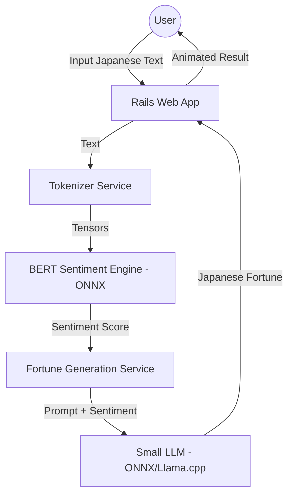

# Technical Design: Sentiment Omikuji

## 1. System Architecture
The application is a standard Ruby on Rails monolith using the ONNX Runtime for local AI inference.

## 2. Core Components

### A. Sentiment Analysis (The "Ear")
- **Model:** `cl-tohoku/bert-base-japanese-v2` (Exported to ONNX).
- **Inference:** `onnxruntime` gem.
- **Task:** Classify input into `Positive`, `Neutral`, or `Negative`.
- **Integration:** A dedicated `SentimentAnalysisService` will wrap the session loading and inference logic.

### B. Fortune Generation (The "Voice")
- **Model Options:**
    1. **GPT-2 Japanese Small (ONNX):** Fast, lightweight (~100MB).
    2. **TinyLlama-1.1B (GGUF via llama-cpp-ruby):** More sophisticated, slightly heavier.
- **Logic:** Based on the BERT score, a prompt template is selected:
    - *Positive:* "You are a kind monk. The user feels happy. Write a short blessing..."
    - *Negative:* "You are a wise advisor. The user is sad. Write a supportive fortune..."

### C. Web Frontend (The "Vibe")
- **UI Framework:** Tailwind CSS with a "traditional Japanese parchment" aesthetic.
- **Interactivity:** 
    - **Turbo Streams:** To update the UI as the AI "thinks" without a full page reload.
    - **Stimulus.js:** To trigger CSS animations (falling blossoms, shaking omikuji box).

## 3. Data Flow
1. User submits text via a `Remote: true` form.
2. `FortunesController#create` receives the text.
3. `SentimentAnalysisService` tokenizes and scores the text.
4. `FortuneGeneratorService` takes the score and generates the text.
5. `Fortune` record is saved to the database (for history/analytics).
6. Rails broadcasts the result back to the user via Turbo Stream.

## 4. Key Challenges & Solutions
- **Model Size:** Keeping the repository lean. Models will be stored in `models/` (ignored by git or tracked via LFS) and loaded into memory on app boot using a Singleton pattern.
- **Latency:** Initial model load is slow; we will use an initializer to pre-load the ONNX sessions.
- **Japanese Tokenization:** The BERT model requires specific WordPiece/MeCab tokenization. We will use the `tokenizers` gem with the `vocab.txt` from our training phase.
