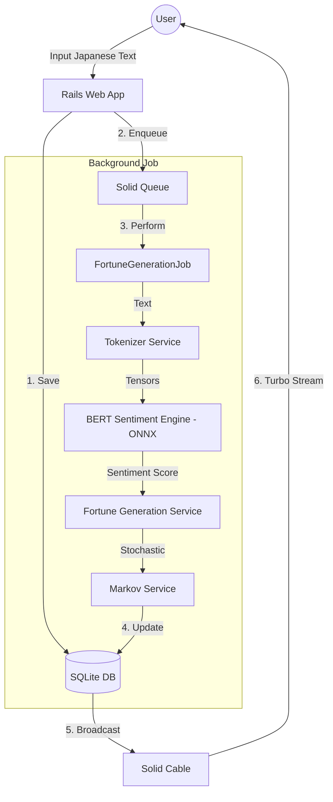

# Technical Design: Sentiment Omikuji

## 1. System Architecture
The application is a modern Ruby on Rails monolith using the ONNX Runtime for local AI inference, with a decoupled background processing layer for high-performance execution.

```mermaid
graph TD
    User((User)) -->|Input Japanese Text| Rails[Rails Web App]
    Rails -->|1. Save| DB[(SQLite DB)]
    Rails -->|2. Enqueue| SQ[Solid Queue]
    
    subgraph Background Job
        SQ -->|3. Perform| Job[FortuneGenerationJob]
        Job -->|Text| Tokenizer[Tokenizer Service]
        Tokenizer -->|Tensors| BERT[BERT Sentiment Engine - ONNX]
        BERT -->|Sentiment Score| FortuneService[Fortune Generation Service]
        FortuneService -->|Stochastic| Markov[Markov Service]
        Markov -->|4. Update| DB
    end
    
    DB -->|5. Broadcast| Cable[Solid Cable]
    Cable -->|6. Turbo Stream| User
```

## 2. Core Components

### A. Sentiment Analysis (The "Ear")
- **Model:** `cl-tohoku/bert-base-japanese-v3` (Exported to ONNX).
- **Inference:** `onnxruntime` gem.
- **Task:** Classify input into `Positive`, `Neutral`, or `Negative`.
- **Integration:** A dedicated `SentimentAnalysisService` wraps the session loading and inference logic.

### B. Fortune Generation (The "Voice")
- **Engine:** Custom Markov Service.
- **Inference:** Pure Ruby morphological n-gram prediction.
- **Logic:** Based on the BERT score, a prompt template is selected to generate a mystical Japanese fortune. Implemented using a Bigram state-map for high-speed, low-memory generation.

### C. Web Frontend (The "Vibe")
- **UI Framework:** Tailwind CSS with a "traditional Japanese parchment" aesthetic.
- **Interactivity:** 
    - **Turbo Streams:** To update the UI as the AI "thinks" without a full page reload, powered by **Solid Cable**.
    - **Stimulus.js:** To trigger CSS animations (falling blossoms, shaking omikuji box).

## 3. Data Flow
1. User submits text via a Hotwire-enhanced form.
2. `FortunesController#create` saves a "pending" `Fortune` record and enqueues a `FortuneGenerationJob`.
3. The background worker picks up the job and runs the `SentimentAnalysisService`.
4. The job then calls `FortuneGeneratorService` (using `MarkovService`) to produce the final text.
5. The `Fortune` record is updated with the results.
6. `Fortune` model `after_update_commit` hook broadcasts the update via **Solid Cable** and **Turbo Streams** to the user's browser.

## 4. Key Challenges & Solutions
- **Model Size:** BERT model is stored in `models/` and loaded into memory using a Singleton pattern (`ModelLoader`).
- **Responsiveness:** By using **Solid Queue** for asynchronous processing, the web process remains free to handle other requests while the AI models compute.
- **Infrastructure Simplicity:** Using the "Solid" stack (Solid Queue, Cache, Cable) with **SQLite** allows the entire application to run as a self-contained monolith without requiring Redis or other external services.
- **Japanese Tokenization:** Uses `natto` for MeCab morphological analysis and the `tokenizers` gem for BERT specific encoding.
